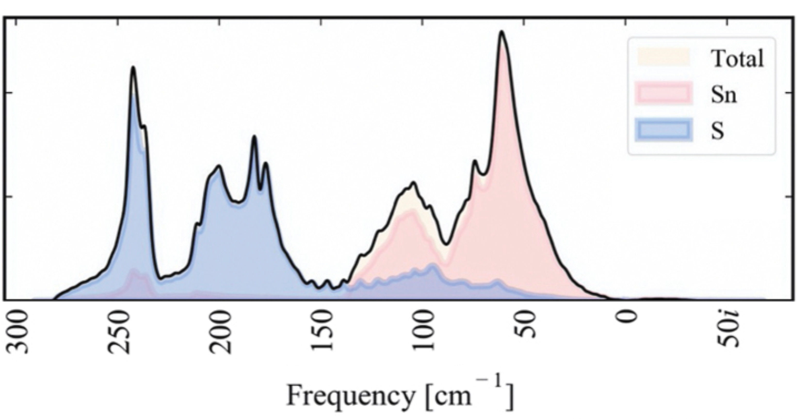
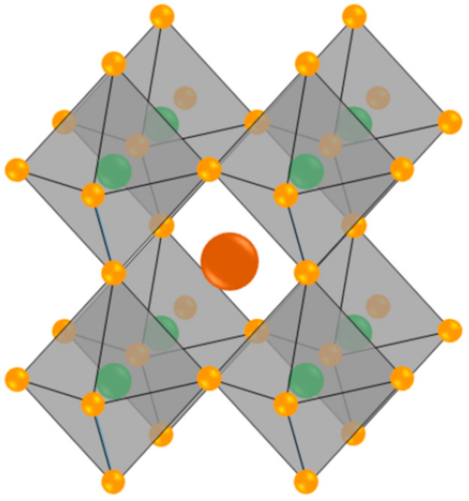

# Singing Materials with Strauss

This repository explores the sonification of atomistic simulation data using the [Strauss](https://www.audiouniverse.org/research/strauss) software package.
We use sonification to listen to the vibrations of materials at an atomic scale; *to hear how the materials sing*.

There are two key parts to this repository. The first is the `phonon_sonification` Python package which is contained in the `phonon_sonification` folder. There are more details about this package in the folder's [README.md](https://github.com/NU-CEM/Singing_Materials_Strauss/tree/main/phonon_sonification). The second are the code and sound examples doted in the `notebooks` folder; these demonstrate what the `phonon_sonification` and Strauss packages can do when applied to materials modelling data.

## What is Sonification?

Sonification is the use of non-speech audio to convey information. A well-known scientific example is the geiger counter which produces an audible click when it detects an ionisation event. Sonification is being increasingly used within the physical sciences, in particular for [astrophysical research](https://www.scientificamerican.com/video/listen-to-the-astonishing-chirp-of-two-black-holes-merging). 
Sonification has also been used as a tool for music composition by a [number of contemporary classical composers](https://www.straebel.com/files/Straebel%202010_Sonification%20Metaphor.pdf). 
The continuum from data representation to data abstraction is briefly discussed in the paper [`Making data sing`](https://www.researchgate.net/profile/Atau-Tanaka/publication/312740596_Making_Data_Sing_Embodied_Approaches_to_Sonification/links/5fc6b5f2299bf188d4e8d59e/Making-Data-Sing-Embodied-Approaches-to-Sonification.pdf).

## Where does the atomistic simulation data come from?

The `phonon_sonification` package interfaces with the [Materials Project](https://next-gen.materialsproject.org/). This database holds data on 100,000's of materials (see Fig. 3). 
The [Materials Project API](https://next-gen.materialsproject.org/api) gives access to vibrational data (and more) for thousands of materials.

<figure>
    
    <figcaption>Figure 3: Screenshot of the Materials Project website</figcaption>
</figure>

## What are in the notebooks?

The `notebooks` folder contains a series of notebooks outlining different approaches to the sonification of materials modelling data.

### Sonification of a Phonon Density of States

[This notebook](./notebooks/Sonification_of_Phonon_DOS.ipynb) sonifies phonon data.
Phonons are quantum mechanical quasi-particles which describe the vibrations of atoms in a material. 
Rather than focus on one particular type of phonon vibration (for example, octahedral tilting), we sonify the phonon density of states (dos, Fig. 2). The dos summarises all of the different types of vibrations across a material; 
it is the density of vibrational states per unit energy (or per unit frequency, as they are related through the relation $E=hf$).

The phonon dos is useful as it provides us with information on crystal structure and chemical composition.
For example, materials which contain organic species will tend to have intra-molecular vibrations at high frequencies, and the vibrations of materials with high compositional complexity often span a greater frequency range.
The phonon dos also determines various material properties including thermal transport and electron-phonon coupling.

<figure>
    
    <figcaption>Figure 2: Tin sulfide (SnS) density of states. Adapted with permission from <a href="https://doi.org/10.1039/d1cp02597j">https://doi.org/10.1039/d1cp02597j</a>.</figcaption>
</figure>
 
 

### Sonification of Octahedral Tilt Amplitudes

[This notebook](./notebooks/Sonification_of_Octahedral_Tilts_Part_One.ipynb) explores the sonification of molecular dynamics data.
Molecular dynamics applies classical mechanics (Newton's laws of motion) to predict the motion of atoms in a material. In this dataset the forces which "drive" the molecular dynamics simulations are calculated using quantum chemistry, 
which provides us with high-accuracy predictions of the material dynamics. 
The material we explore is BaZrS3, a potential new photovoltaic material which is at an early stage of development. 

BaZrS3 is in the perovskite crystal structure (see Fig. 1 below). This consists of 3D-connected octahedral building blocks.
We sonify the parameters which describe the extent of octahedral tilting. We treat the datasets as both continuous ([part one](./notebooks/Sonification_of_Octahedral_Tilts_Part_One.ipynb)) and discrete ([part two](./notebooks/Sonification_of_Octahedral_Tilts_Part_Two.ipynb)), and explore the effect of data smoothing. 
All the data in this repository has been published as part of our [recent study](https://pubs.acs.org/doi/10.1021/acs.jpclett.4c03517). 

<figure>
    
    <figcaption>Figure 1: Perovskite crystal structure</figcaption>
</figure>

## How do I run the notebooks?

The notebooks contain links to audio files so that you can listen through your browser to the sonifications which are produced by the code.

If you want to edit or run the notebooks locally you will need to:
- install the [Strauss](https://www.audiouniverse.org/research/strauss) python package.
- install the [Materials Project API](https://docs.materialsproject.org/downloading-data/using-the-api/getting-started) python package.
- register for a Materials Project account generate an API key. More details are [here](https://next-gen.materialsproject.org/api).
- store the Materials Project API Key in a `.env` file with the MP_API_KEY variable.
- `git clone` this full repository, which contains the necessary data, and the `phonon_sonification` Python package.

